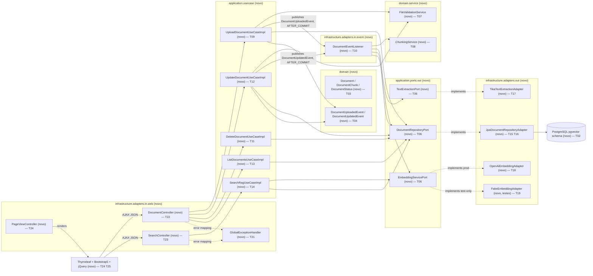

# Implementation Plan

## Request Summary
- Objective: build the "Help Desk Inteligente com RAG" reference architecture from scratch — Spring Boot + PostgreSQL/pgvector, Hexagonal Architecture, document upload/CRUD with async post-commit processing (Tika extraction, chunking, OpenAI embeddings), soft delete + optimistic locking, cosine-similarity semantic search with scoring, Thymeleaf/Bootstrap5/jQuery UI, full unit + Testcontainers integration test coverage.
- Scope:
  - **In**: upload validation (ext/content-type/size), transactional PENDING persistence + post-commit event processing, state machine `PENDING→PROCESSING→PROCESSED|ERROR` (incl. zero-chunk→ERROR), infinite-scroll listing (batches of 20), update with old-chunk deletion + reprocessing, soft delete with physical chunk/vector deletion, optimistic-lock 409 + PROCESSING-conflict 409, native pgvector cosine search with `[0,100]` 2-decimal score, `EmbeddingServicePort` (OpenAI + deterministic Fake), Flyway `V1__init_schema.sql`, strict Hexagonal package layout under `com.helpdesk.rag`, JUnit5+Mockito unit tests, Testcontainers (`pgvector/pgvector:pg16`) integration tests.
  - **Out**: authentication/authorization, multi-tenancy, multi-file history/versioning, hard delete, formats beyond PDF/TXT, embedding providers beyond OpenAI/Fake, horizontal-scale topology, i18n.
- Tier: complete
- Architecture references: **missing** — no `AGENTS.md` / `docs/agents/*.md` / `.github/copilot-instructions.md` exist in this greenfield repository. Per the developer's explicit confirmation (SPEC Q-01), `prompts.md` §2 ("Estrutura de Pacotes — Arquitetura Hexagonal") is used as the **sole** convention source for package layout and layering rules. This PLAN is **not architecture-validated** against a dedicated architecture doc — treat `prompts.md` §2 as provisional guidance only, and consider promoting it to an `AGENTS.md` after this feature ships (see Open Questions).

## AS IS — Componentes impactados

_AS IS não aplicável — feature greenfield (repositório contém apenas `prompts.md` e `.spec/`; nenhum código-fonte existente)._

## TO BE — Componentes propostos

Toda a árvore é nova (greenfield): a camada web (T22/T23/T24/T21) expõe os contratos CT-01..CT-05; o listener assíncrono pós-commit (T10) e os serviços de suporte de domínio (T07/T08) realizam RF-01..RF-04, RF-06; os use cases de aplicação (T09,T11,T12,T13,T14) orquestram via portas de saída (T06), implementadas pelos adapters de persistência/IA (T15,T16,T17,T18,T19) sobre o schema pgvector (T02). Os ids de task acima rastreiam cada nó/aresta novo até a tarefa que o produz.

## Tasks

### T01 — Project scaffolding
- **Files**: `pom.xml`, `src/main/resources/application.yml`, `src/main/resources/application-prod.yml`, `src/test/resources/application-test.yml`, `docker-compose.yml`, `README.md`, `src/test/java/com/helpdesk/rag/HelpdeskRagApplicationTests.java`
- **Change**: Spring Boot 3.3.x/Java 17 Maven project with dependencies per `prompts.md` §1 (Spring Web, Spring Data JPA, Validation, Thymeleaf, PostgreSQL driver, `pgvector-java`, Flyway, Spring AI OpenAI starter, Apache Tika, Testcontainers JUnit5+PostgreSQL). `application.yml` wires default (test-safe) profile without requiring `OPENAI_API_KEY`; `application-prod.yml` carries the OpenAI key placeholder read from env var. `docker-compose.yml` runs `pgvector/pgvector:pg16` for local dev only (not used by automated tests). `README.md` documents run instructions and contains an explicit statement that authentication/authorization (Spring Security) is intentionally out of scope for this reference case (RNF-08).
- **Covers**: RNF-08
- **Tests**: `src/test/java/com/helpdesk/rag/HelpdeskRagApplicationTests.java` — Spring context loads successfully with no `OPENAI_API_KEY` set and no network access (smoke test supporting RNF-04).
- **Risk**: Low — scaffolding only, no business logic.
- **Dependencies**: none

### T02 — Flyway migration `V1__init_schema.sql`
- **Files**: `src/main/resources/db/migration/V1__init_schema.sql`
- **Change**: `CREATE EXTENSION IF NOT EXISTS vector;`; table `documents` (`id UUID PK`, `file_name VARCHAR(255) NOT NULL`, `content_type VARCHAR(100)`, `file_size BIGINT NOT NULL`, `file_data BYTEA NOT NULL`, `status VARCHAR(20) NOT NULL CHECK (status IN ('PENDING','PROCESSING','PROCESSED','ERROR','DELETED'))`, `error_message TEXT`, `uploaded_at TIMESTAMP NOT NULL DEFAULT now()`, `updated_at TIMESTAMP`, `deleted_at TIMESTAMP`, `version BIGINT NOT NULL DEFAULT 0`); table `document_chunks` (`id UUID PK`, `document_id UUID NOT NULL REFERENCES documents(id) ON DELETE CASCADE`, `chunk_index INT NOT NULL`, `chunk_text TEXT NOT NULL`, `embedding VECTOR(1536) NOT NULL`, `created_at TIMESTAMP NOT NULL DEFAULT now()`); supporting btree index `documents(status, uploaded_at DESC, id DESC)` for the listing/keyset query; HNSW index `ON document_chunks USING hnsw (embedding vector_cosine_ops) WITH (m = 16, ef_construction = 64)` (defaults, undocumented by SPEC — FLEXIBLE choice).
- **Covers**: RNF-03
- **Tests**: verified by `T26` schema-verification integration test (`SchemaMigrationIT`) — dedicated unit test not applicable to a pure SQL migration.
- **Risk**: Medium — wrong vector extension/index syntax breaks every downstream persistence task; mitigated by running against real `pgvector/pgvector:pg16` in T26 before any adapter code depends on it.
- **Dependencies**: none

### T03 — Domain model
- **Files**: `src/main/java/com/helpdesk/rag/domain/DocumentStatus.java`, `src/main/java/com/helpdesk/rag/domain/Document.java`, `src/main/java/com/helpdesk/rag/domain/DocumentChunk.java`
- **Change**: Pure domain classes with zero framework dependencies (no JPA/Spring annotations — RNF-01). `DocumentStatus` enum: `PENDING, PROCESSING, PROCESSED, ERROR, DELETED`. `Document` carries id, fileName, contentType, fileSize, fileData, status, errorMessage, uploadedAt, updatedAt, deletedAt, version, plus state-transition methods (`markProcessing()`, `markProcessed()`, `markError(String message)`, `markDeleted(Instant now)`) that enforce valid transitions and throw `IllegalStateException` on invalid ones. `DocumentChunk` carries id, documentId, chunkIndex, chunkText, embedding (`float[1536]`).
- **Covers**: RNF-01 (domain purity baseline for all RF-01..RF-12)
- **Tests**: `src/test/java/com/helpdesk/rag/domain/DocumentTest.java` — valid transitions succeed (`PENDING→PROCESSING→PROCESSED`, `PROCESSING→ERROR`), invalid transitions throw (e.g. `PENDING→PROCESSED` directly), `markDeleted` sets `status=DELETED`+`deletedAt`.
- **Risk**: Low — pure logic, no I/O.
- **Dependencies**: none

### T04 — Domain events
- **Files**: `src/main/java/com/helpdesk/rag/domain/event/DocumentUploadedEvent.java`, `src/main/java/com/helpdesk/rag/domain/event/DocumentUpdatedEvent.java`
- **Change**: Immutable event POJOs carrying `documentId` (UUID) and `occurredAt` (Instant); no framework dependency (plain classes, published via Spring's `ApplicationEventPublisher` from the use cases, so no `@Component`/annotations needed here).
- **Covers**: RF-01, RF-06
- **Tests**: covered transitively by T09/T12 unit tests (event published on save) — no dedicated test for these value objects.
- **Risk**: Low.
- **Dependencies**: T03

### T05 — Application ports in
- **Files**: `src/main/java/com/helpdesk/rag/application/ports/in/UploadDocumentUseCase.java`, `ListDocumentsUseCase.java`, `UpdateDocumentUseCase.java`, `DeleteDocumentUseCase.java`, `SearchRagUseCase.java` (each with an accompanying `*Command`/`*Result` record in the same package)
- **Change**: Interfaces per `prompts.md` §4: `UploadDocumentUseCase.upload(UploadDocumentCommand): UploadDocumentResult`; `ListDocumentsUseCase.list(ListDocumentsQuery): DocumentPageResult` (keyset cursor + fixed batch size 20); `UpdateDocumentUseCase.update(UpdateDocumentCommand): UpdateDocumentResult`; `DeleteDocumentUseCase.delete(DeleteDocumentCommand): void`; `SearchRagUseCase.search(SearchQuery): List<SearchResult>`.
- **Covers**: RNF-01
- **Tests**: none (interfaces only; behavior tested via implementations T09/T11/T12/T13/T14).
- **Risk**: Low.
- **Dependencies**: T03

### T06 — Application ports out
- **Files**: `src/main/java/com/helpdesk/rag/application/ports/out/DocumentRepositoryPort.java`, `EmbeddingServicePort.java`, `TextExtractionPort.java`
- **Change**: `DocumentRepositoryPort`: `save(Document)`, `findById(UUID)`, `findBatch(cursor, size)` (keyset), `deleteChunksByDocumentId(UUID)`, `saveChunks(List<DocumentChunk>)`, `findSimilarChunks(float[] queryVector, int limit)` returning chunk+score projections, optimistic-lock-aware `save` that surfaces `ObjectOptimisticLockingFailureException`. `EmbeddingServicePort`: `embed(String text): float[]` (exactly 1536 dims — CT-06). `TextExtractionPort`: `extractText(byte[] content, String contentType): String`.
- **Covers**: CT-06, RNF-01
- **Tests**: none (interfaces only).
- **Risk**: Low.
- **Dependencies**: T03

### T07 — `FileValidationService`
- **Files**: `src/main/java/com/helpdesk/rag/domain/service/FileValidationService.java`, `src/main/java/com/helpdesk/rag/domain/exception/DocumentValidationException.java`
- **Change**: Validates extension (`.pdf`/`.txt` only), size (≤10,485,760 bytes), and content-type per RF-11's exact rule: extension is primary signal; missing/`application/octet-stream` content-type is accepted when extension is valid; a present content-type is rejected only when it explicitly contradicts a known type for that extension (e.g. `.txt` + `image/png`). Throws `DocumentValidationException` on any failure (mapped to HTTP 400 in T21). Shared by both `UploadDocumentUseCaseImpl` (T09) and `UpdateDocumentUseCaseImpl` (T12) to avoid duplicated validation logic.
- **Covers**: RF-11
- **Tests**: `src/test/java/com/helpdesk/rag/domain/service/FileValidationServiceTest.java` — valid `.pdf`/`.txt` accepted; invalid extension rejected; size exactly at 10,485,760 bytes accepted, 10,485,761 bytes rejected (RNF-07 exact threshold); missing content-type accepted; `application/octet-stream` accepted; `.txt` + `image/png` rejected; `.pdf` + `application/pdf` accepted.
- **Risk**: Low — pure validation logic, but high test-count needed for exact boundary coverage (RNF-07).
- **Dependencies**: T03

### T08 — `ChunkingService`
- **Files**: `src/main/java/com/helpdesk/rag/domain/service/ChunkingService.java`
- **Change**: Splits extracted text by paragraph (blank-line-delimited) when possible; falls back to fixed 1000-character blocks with 200-character overlap when paragraph splitting is not possible (e.g. single unbroken block of text). Returns an empty list for blank/whitespace-only input (feeding RF-02's zero-chunk→ERROR path).
- **Covers**: RF-02, RNF-07 (chunk size/overlap exactness)
- **Tests**: `src/test/java/com/helpdesk/rag/domain/service/ChunkingServiceTest.java` — multi-paragraph text splits by paragraph; single-block 2500-char text falls back to fixed chunks of exactly 1000 chars with exactly 200-char overlap (verify chunk boundaries and count); blank/whitespace-only input returns an empty list.
- **Risk**: Low-Medium — off-by-one errors in overlap math are easy to introduce; covered by exact-boundary tests.
- **Dependencies**: T03

### T09 — `UploadDocumentUseCaseImpl`
- **Files**: `src/main/java/com/helpdesk/rag/application/usecase/UploadDocumentUseCaseImpl.java`
- **Change**: `@Transactional` method: validates the file via `FileValidationService` (T07) before any persistence (RF-11); on success, builds a `Document` with `status=PENDING`, persists via `DocumentRepositoryPort`, and publishes `DocumentUploadedEvent` through `ApplicationEventPublisher` for post-commit handling (RF-01). Returns id + `status=PENDING`.
- **Covers**: RF-01, RF-11
- **Tests**: `src/test/java/com/helpdesk/rag/application/usecase/UploadDocumentUseCaseImplTest.java` — valid upload persists `Document` with `status=PENDING` and publishes `DocumentUploadedEvent` exactly once; invalid extension/size rejected with zero persistence calls; content-type fallback (`application/octet-stream`/absent) accepted; contradictory content-type rejected.
- **Risk**: Medium — entry point for RF-01's transactional guarantee (event must never fire before commit); mitigated by RNF-02 integration test T30.
- **Dependencies**: T03, T04, T05, T06, T07

### T10 — `DocumentEventListener`
- **Files**: `src/main/java/com/helpdesk/rag/infrastructure/adapters/in/event/DocumentEventListener.java`
- **Change**: `@Async("documentProcessingExecutor")` + `@TransactionalEventListener(phase = TransactionPhase.AFTER_COMMIT)` methods for `DocumentUploadedEvent` and `DocumentUpdatedEvent`. Upload path: mark `status=PROCESSING` (RF-03), extract text (`TextExtractionPort`), chunk (`ChunkingService`), embed each chunk (`EmbeddingServicePort`), persist chunks; if chunking yields zero chunks, set `status=ERROR` with message `"Nenhum conteúdo extraído do documento"` and persist zero `document_chunks` rows (RF-02 zero-chunk AC); otherwise set `status=PROCESSED`. Update path: same, but first physically deletes existing `document_chunks` for the document (`deleteChunksByDocumentId`) before reprocessing (RF-06). On any exception during extraction/chunking/embedding, catches it, sets `status=ERROR` with the failure message, and guarantees no partially-inserted chunk rows remain for that `document_id` (chunks are only persisted as a batch after all embeddings for the document succeed, or explicitly rolled back on failure) — this is what makes RF-04's "excluído da busca por conteúdo" guarantee hold even for partial failures.
- **Covers**: RF-02, RF-03, RF-04, RF-06, RNF-02
- **Tests**: `src/test/java/com/helpdesk/rag/infrastructure/adapters/in/event/DocumentEventListenerTest.java` (mocked ports) — success path produces ≥1 chunk with 1536-dim non-null vectors and `status=PROCESSED`; zero-chunk path sets `status=ERROR` with the exact fixed message and zero chunk persistence calls; extraction/embedding exception sets `status=ERROR` with a non-null message and zero orphan chunk-save calls; update event deletes old chunks before any new chunk is saved (call-order assertion).
- **Risk**: High — core async orchestration; failure here breaks RF-02/03/04/06 simultaneously. Mitigated by both unit tests here and integration tests T27/T30.
- **Dependencies**: T03, T04, T06, T08

### T11 — `DeleteDocumentUseCaseImpl`
- **Files**: `src/main/java/com/helpdesk/rag/application/usecase/DeleteDocumentUseCaseImpl.java`, `src/main/java/com/helpdesk/rag/domain/exception/DocumentProcessingConflictException.java`
- **Change**: Rejects with `DocumentProcessingConflictException` (mapped to HTTP 409 in T21) when the target document's `status=PROCESSING` (RF-07). Otherwise sets `status=DELETED` + `deletedAt=now()` and physically deletes associated `document_chunks`/vectors via `DocumentRepositoryPort` (RF-08). Relies on `@Version`-aware `save` to surface a stale-version conflict as an optimistic-lock exception (RF-12), translated to 409 in T21.
- **Covers**: RF-07, RF-08, RF-09
- **Tests**: `src/test/java/com/helpdesk/rag/application/usecase/DeleteDocumentUseCaseImplTest.java` — non-`PROCESSING` document soft-deleted and chunks removal invoked; `PROCESSING` document rejected with no mutating repository calls.
- **Risk**: Medium — irreversible physical chunk deletion; mitigated by explicit conflict check before mutation and integration test T29.
- **Dependencies**: T03, T05, T06

### T12 — `UpdateDocumentUseCaseImpl`
- **Files**: `src/main/java/com/helpdesk/rag/application/usecase/UpdateDocumentUseCaseImpl.java`
- **Change**: Rejects with `DocumentProcessingConflictException` (409) when the target document's `status=PROCESSING` (RF-07). Otherwise validates the new file via `FileValidationService` (T07, reusing RF-11 rules), replaces `fileName`/`contentType`/`fileSize`/`fileData`, sets `status=PROCESSING`, saves via `DocumentRepositoryPort` (surfacing stale-version conflicts as 409 per RF-12), and publishes `DocumentUpdatedEvent` for post-commit reprocessing (RF-06).
- **Covers**: RF-06, RF-07, RF-11
- **Tests**: `src/test/java/com/helpdesk/rag/application/usecase/UpdateDocumentUseCaseImplTest.java` — valid update on non-`PROCESSING` document sets `status=PROCESSING`, persists, and publishes `DocumentUpdatedEvent`; `PROCESSING` document rejected with no mutation; invalid replacement file rejected via the shared validator with no event published.
- **Risk**: Medium — shares the RF-07/RF-12 conflict surface with Delete; mitigated by integration test T29.
- **Dependencies**: T03, T04, T05, T06, T07

### T13 — `ListDocumentsUseCaseImpl`
- **Files**: `src/main/java/com/helpdesk/rag/application/usecase/ListDocumentsUseCaseImpl.java`
- **Change**: Delegates to `DocumentRepositoryPort.findBatch(cursor, 20)` (fixed batch size — RNF-07), which excludes `status=DELETED` and orders by `uploaded_at DESC, id DESC` (RF-05). Maps repository rows to `DocumentPageResult` (items + opaque `nextCursor`, `null` when exhausted).
- **Covers**: RF-05
- **Tests**: `src/test/java/com/helpdesk/rag/application/usecase/ListDocumentsUseCaseImplTest.java` — mocked port returning 20 canned items maps to exactly 20 results with a non-null cursor; mocked port returning <20 items (last page) maps to a `null` cursor; requesting with a cursor forwards it unchanged to the port (no duplication logic in the use case itself).
- **Risk**: Low — thin orchestration; correctness of exclusion/ordering lives in T16 and is covered by integration test T27/T28.
- **Dependencies**: T03, T05, T06

### T14 — `SearchRagUseCaseImpl`
- **Files**: `src/main/java/com/helpdesk/rag/application/usecase/SearchRagUseCaseImpl.java`
- **Change**: Embeds the question via `EmbeddingServicePort.embed(question)`, delegates to `DocumentRepositoryPort.findSimilarChunks(vector, limit)`, and maps the already-scored/ordered results to `SearchResult` DTOs without re-sorting or re-computing score (the native query owns score calculation and ordering — RF-10).
- **Covers**: RF-10
- **Tests**: `src/test/java/com/helpdesk/rag/application/usecase/SearchRagUseCaseImplTest.java` — question is embedded exactly once; port results (canned, pre-scored/ordered) pass through unchanged in the same order; empty port result maps to an empty list.
- **Risk**: Low — orchestration only; the numerically sensitive part (score/order) lives in T16 and is covered by integration test T28.
- **Dependencies**: T03, T05, T06

### T15 — JPA entities, Spring Data repositories, and mapper
- **Files**: `src/main/java/com/helpdesk/rag/infrastructure/adapters/out/persistence/DocumentJpaEntity.java`, `DocumentChunkJpaEntity.java`, `SpringDataDocumentJpaRepository.java`, `SpringDataDocumentChunkJpaRepository.java`, `DocumentPersistenceMapper.java`
- **Change**: JPA entities mapping 1:1 to the T02 schema, including `@Version` on `DocumentJpaEntity.version` (RF-12) and a custom `VectorType`/converter for `document_chunks.embedding` (`float[1536]` ↔ pgvector `VECTOR(1536)`, using `pgvector-java`'s Hibernate type support). `DocumentPersistenceMapper` converts between JPA entities and pure domain objects (T03) so domain never depends on `jakarta.persistence`.
- **Covers**: RNF-01 (domain/infrastructure separation), RNF-03 (mapping to the migrated schema), RF-12 (`@Version` field)
- **Tests**: `src/test/java/com/helpdesk/rag/infrastructure/adapters/out/persistence/DocumentPersistenceMapperTest.java` — round-trip domain→entity→domain preserves every field including `version`, `deletedAt`, and `errorMessage` nullability.
- **Risk**: Medium — the pgvector column mapping is the least standard part of the JPA layer; mitigated by integration test T26/T27 exercising it against a real container.
- **Dependencies**: T02, T03

### T16 — `JpaDocumentRepositoryAdapter`
- **Files**: `src/main/java/com/helpdesk/rag/infrastructure/adapters/out/persistence/JpaDocumentRepositoryAdapter.java`, native `@Query` additions on `SpringDataDocumentChunkJpaRepository`/`SpringDataDocumentJpaRepository`
- **Change**: Implements `DocumentRepositoryPort`. Listing query: `SELECT ... FROM documents WHERE status <> 'DELETED' AND (uploaded_at, id) < (:cursorUploadedAt, :cursorId) ORDER BY uploaded_at DESC, id DESC LIMIT 20` (keyset pagination — RF-05/CT-02 FLEXIBLE resolution; first page omits the cursor predicate). Similarity query: native SQL `SELECT c.*, ROUND(LEAST(GREATEST((1 - (c.embedding <=> :queryVector)) * 100, 0), 100)::numeric, 2) AS score FROM document_chunks c JOIN documents d ON d.id = c.document_id WHERE d.status = 'PROCESSED' ORDER BY c.embedding <=> :queryVector LIMIT :limit` (RF-10, clamped `[0,100]`, 2 decimals, `PROCESSED`-only implicitly excludes `DELETED`/`ERROR`/`PENDING`/`PROCESSING` — RF-04, RF-09). `deleteChunksByDocumentId` issues a physical `DELETE` (RF-08). `save` catches/lets propagate `ObjectOptimisticLockingFailureException` on stale `@Version` (RF-12).
- **Covers**: RF-05, RF-08, RF-09, RF-10, RF-12
- **Tests**: covered by integration suite (T27, T28, T29) — native SQL/index behavior cannot be meaningfully unit-tested without a real pgvector instance.
- **Risk**: High — the score formula and cosine-distance native query are the most numerically/SQL-sensitive code in the feature; any off-by-one in the clamp/round breaks RF-10's AC. Mitigated by dedicated integration test T28 asserting exact score values against `FakeEmbeddingAdapter`'s deterministic vectors.
- **Dependencies**: T15

### T17 — `TikaTextExtractionAdapter`
- **Files**: `src/main/java/com/helpdesk/rag/infrastructure/adapters/out/ai/TikaTextExtractionAdapter.java`
- **Change**: Implements `TextExtractionPort` using Apache Tika's `AutoDetectParser` to extract plain text from PDF/TXT byte content, covering both formats with the same API (per `prompts.md` §1).
- **Covers**: RF-02
- **Tests**: `src/test/java/com/helpdesk/rag/infrastructure/adapters/out/ai/TikaTextExtractionAdapterTest.java` (with small fixture files under `src/test/resources/fixtures/`) — extracts non-empty text from a sample `.pdf` and `.txt`; returns empty/blank string for a blank `.txt` fixture (feeding the zero-chunk path).
- **Risk**: Low-Medium — Tika parsing edge cases (encrypted/corrupt PDFs) are out of scope per SPEC; only the empty-content path is contractually required.
- **Dependencies**: T06

### T18 — `OpenAiEmbeddingAdapter`
- **Files**: `src/main/java/com/helpdesk/rag/infrastructure/adapters/out/ai/OpenAiEmbeddingAdapter.java`
- **Change**: Implements `EmbeddingServicePort` via Spring AI's `EmbeddingModel` abstraction configured for OpenAI `text-embedding-3-small` (1536 dims), API key read from `OPENAI_API_KEY` env var (never hardcoded); active only in the `prod`/default (non-test) profile so the automated test suite never instantiates it (RNF-04).
- **Covers**: CT-06
- **Tests**: `src/test/java/com/helpdesk/rag/infrastructure/adapters/out/ai/OpenAiEmbeddingAdapterTest.java` — with a mocked Spring AI `EmbeddingModel`, verifies the adapter delegates the input text and returns a 1536-length `float[]`; no real network call is made in this test.
- **Risk**: Low — thin delegation to Spring AI; real network behavior is inherently untested per RNF-04 (acceptable, documented).
- **Dependencies**: T06

### T19 — `FakeEmbeddingAdapter` (test-only)
- **Files**: `src/test/java/com/helpdesk/rag/infrastructure/adapters/out/ai/FakeEmbeddingAdapter.java`, `src/test/java/com/helpdesk/rag/infrastructure/config/TestEmbeddingConfig.java`
- **Change**: Deterministic implementation of `EmbeddingServicePort` (e.g. seeded hash of the normalized input text expanded to 1536 floats) with no network/API-key dependency. Lives exclusively under `src/test/java` (not shipped in the production JAR) and is wired as the active `EmbeddingServicePort` bean for the `test` profile via `@TestConfiguration`, enforcing "exclusivamente em testes" (CT-06) at the build level rather than by a runtime `@Profile` guard in `src/main`.
- **Covers**: CT-06, RNF-04
- **Tests**: `src/test/java/com/helpdesk/rag/infrastructure/adapters/out/ai/FakeEmbeddingAdapterTest.java` — same input text yields byte-identical vectors across repeated calls (determinism, RNF-06's "scores repetíveis" prerequisite); output is exactly 1536 elements (RNF-07).
- **Risk**: Low.
- **Dependencies**: T06

### T20 — `AsyncConfig`
- **Files**: `src/main/java/com/helpdesk/rag/infrastructure/config/AsyncConfig.java`
- **Change**: `@Configuration` + `@EnableAsync` declaring the `documentProcessingExecutor` `TaskExecutor` bean (thread-pool `ThreadPoolTaskExecutor`, name per `prompts.md` FLEXIBLE suggestion) used by `DocumentEventListener` (T10); ensures `@TransactionalEventListener` is honored (Spring Boot auto-configures the transactional event multicaster — no extra bean needed, but explicitly documented here as an assumption check).
- **Covers**: RNF-02
- **Tests**: covered by integration test T30 (verifies the actual non-blocking behavior end-to-end); no meaningful unit test for a pure bean-definition class.
- **Risk**: Low-Medium — a misconfigured executor (e.g. missing `@EnableAsync`) silently makes the listener run synchronously, defeating RNF-02; caught by T30.
- **Dependencies**: none

### T21 — `GlobalExceptionHandler`
- **Files**: `src/main/java/com/helpdesk/rag/infrastructure/adapters/in/web/GlobalExceptionHandler.java`
- **Change**: `@RestControllerAdvice` mapping `DocumentValidationException` (T07) → HTTP 400 with a `ValidationErrorResponse` body; `DocumentProcessingConflictException` (T11/T12) → HTTP 409; `org.springframework.orm.ObjectOptimisticLockingFailureException` (thrown by T16 on stale `@Version`) → HTTP 409 (RF-12, distinct message from the `PROCESSING`-conflict case); a `NoSuchElementException`/`DocumentNotFoundException` → HTTP 404 for unknown `document_id` on update/delete (standard REST resource-not-found handling, not itself a RIGID requirement — see Assumptions).
- **Covers**: RF-04 (indirect), RF-07, RF-11, RF-12, CT-01, CT-03, CT-04
- **Tests**: `src/test/java/com/helpdesk/rag/infrastructure/adapters/in/web/GlobalExceptionHandlerTest.java` (MockMvc slice, thrown-exception simulation) — each exception type maps to its documented status code and response shape.
- **Risk**: Medium — a wrong mapping here silently breaks every CT-01..CT-05 error-path AC at once.
- **Dependencies**: T07, T09, T11, T12

### T22 — `DocumentController`
- **Files**: `src/main/java/com/helpdesk/rag/infrastructure/adapters/in/web/DocumentController.java`, `src/main/java/com/helpdesk/rag/infrastructure/adapters/in/web/dto/UploadDocumentResponse.java`, `DocumentSummaryResponse.java`, `DocumentListResponse.java`, `UpdateDocumentResponse.java`
- **Change**: `POST /api/documents` (multipart, RF-01/RF-11 → 201 + `UploadDocumentResponse`); `GET /api/documents?cursor={opaque}` (RF-05 → 200 + `DocumentListResponse`, fixed batch of 20, no client-overridable size — RNF-07); `PUT /api/documents/{id}` (multipart, RF-06/RF-07/RF-11 → 200 + `UpdateDocumentResponse` with `status=PROCESSING`, or 409/400 via T21); `DELETE /api/documents/{id}` (RF-07/RF-08 → 204, or 409 via T21). Implements CT-01..CT-04 exactly per `openapi.yaml` (see Contracts emitted).
- **Covers**: CT-01, CT-02, CT-03, CT-04, RF-01, RF-05, RF-06, RF-07, RF-08, RF-11, RF-12
- **Tests**: `src/test/java/com/helpdesk/rag/infrastructure/adapters/in/web/DocumentControllerTest.java` (MockMvc, mocked use cases) — 201 on valid upload; 400 on invalid extension/oversized file; 200 + 20 items on list; 200/`PROCESSING` on valid update; 409 on update/delete against a `PROCESSING` document (mocked use case throwing `DocumentProcessingConflictException`); 204 on delete.
- **Risk**: Medium — the seam where every RIGID contract (CT-01..CT-04) becomes wire-observable; mitigated by MockMvc tests here and full-stack integration tests T27/T29.
- **Dependencies**: T09, T11, T12, T13, T21

### T23 — `SearchController`
- **Files**: `src/main/java/com/helpdesk/rag/infrastructure/adapters/in/web/SearchController.java`, `src/main/java/com/helpdesk/rag/infrastructure/adapters/in/web/dto/SearchRequest.java`, `SearchResultResponse.java`
- **Change**: `POST /api/search` with JSON body `{"question": "..."}` (RF-10/CT-05 FLEXIBLE resolution — POST+JSON chosen over `GET ?q=` to avoid URL-encoding/length issues for free-text questions); returns HTTP 200 with a bare JSON array of `SearchResultResponse` (documentId, documentName, chunkText, score), already ordered by score desc from the use case.
- **Covers**: CT-05, RF-10
- **Tests**: `src/test/java/com/helpdesk/rag/infrastructure/adapters/in/web/SearchControllerTest.java` (MockMvc, mocked `SearchRagUseCase`) — valid question returns a JSON array in the exact order/shape the use case produced; blank question rejected with 400 (Bean Validation `@NotBlank`).
- **Risk**: Low-Medium — thin controller; numerically sensitive logic lives in T16.
- **Dependencies**: T14, T21

### T24 — Thymeleaf views + `PageViewController`
- **Files**: `src/main/resources/templates/upload.html`, `documents.html`, `search.html`, `fragments/layout.html`, `src/main/java/com/helpdesk/rag/infrastructure/adapters/in/web/PageViewController.java`
- **Change**: `PageViewController` serves `GET /`, `GET /documents`, `GET /search`, `GET /upload` (server-rendered shell pages only — no business data pre-rendered beyond the empty page shell, since data loads via jQuery AJAX per UI-01/UI-02/UI-03). Bootstrap 5 (CDN) layout fragment shared across pages. `documents.html` includes a table/list container plus a colored status badge template (`PENDING`=secondary, `PROCESSING`=info, `PROCESSED`=success, `ERROR`=danger) and edit/delete action controls per row (UI-02). `search.html` includes a question input + results container for AJAX-rendered cards (UI-03). `upload.html` includes the upload form (UI-01).
- **Covers**: UI-01, UI-02, UI-03
- **Tests**: `src/test/java/com/helpdesk/rag/infrastructure/adapters/in/web/PageViewControllerTest.java` (MockMvc) — `GET /documents`, `GET /search`, `GET /upload` each return HTTP 200 and resolve the expected view name.
- **Risk**: Low.
- **Dependencies**: T22, T23

### T25 — Static JS assets (jQuery AJAX)
- **Files**: `src/main/resources/static/js/upload.js`, `src/main/resources/static/js/documents.js`, `src/main/resources/static/js/search.js`
- **Change**: `upload.js` — jQuery AJAX form submit to `POST /api/documents`, renders success/error feedback inline without navigation (UI-01). `documents.js` — initial `GET /api/documents` on page load rendering the first 20 rows with status badges; scroll-position listener that, when the user nears the bottom of the currently loaded list, automatically issues the next `GET /api/documents?cursor=...` request and appends results (no "carregar mais" button — UI-02/RF-05); wires edit/delete row actions to `PUT`/`DELETE /api/documents/{id}` with 409-aware inline error feedback. `search.js` — AJAX `POST /api/search` on form submit, renders Bootstrap cards (document name, chunk excerpt, score as a percentage) ordered as returned by the API (UI-03).
- **Covers**: UI-01, UI-02, UI-03
- **Tests**: no automated JS test runner is in the declared stack (JUnit5+Mockito+Testcontainers only — `prompts.md` §1); covered instead by the MockMvc/view tests in T24 (page renders and includes the script tags) and manual QA. This is a known coverage gap for client-side behavior, not a RIGID test requirement (UI-01/02/03 ACs are about server-observable outcomes, satisfied by the endpoints under T22/T23).
- **Risk**: Low — no server-side blast radius; UX-only.
- **Dependencies**: T24

### T26 — Testcontainers base infrastructure + schema verification
- **Files**: `src/test/java/com/helpdesk/rag/support/AbstractIntegrationTest.java`, `src/test/java/com/helpdesk/rag/infrastructure/adapters/out/persistence/SchemaMigrationIT.java`
- **Change**: `AbstractIntegrationTest` bootstraps a shared `@Testcontainers` singleton `PostgreSQLContainer` (image `pgvector/pgvector:pg16`), wires Spring Boot Test against it (`@DynamicPropertySource`), runs Flyway automatically on context start, and activates the `test` profile (T19's `FakeEmbeddingAdapter`). `SchemaMigrationIT` extends it and asserts the migration outcome directly (RNF-03 AC).
- **Covers**: RNF-03, RNF-04 (test-infra prerequisite), RNF-06 (shared base for all 5 scenarios)
- **Tests**: `SchemaMigrationIT` — after `flyway migrate`, `pg_extension` contains `vector`; `documents` and `document_chunks` exist with the specified columns; an index with access method `hnsw` and operator class `vector_cosine_ops` exists on `document_chunks.embedding`.
- **Risk**: Medium — if the container/profile wiring is wrong, every downstream integration test (T27-T30) fails opaquely; kept as its own task to isolate that failure mode early.
- **Dependencies**: T02, T15

### T27 — Integration test: upload/post-commit flow
- **Files**: `src/test/java/com/helpdesk/rag/UploadDocumentFlowIT.java`
- **Change**: Full-stack test (MockMvc against `DocumentController`, real Testcontainers DB, `FakeEmbeddingAdapter`) covering: (a) valid `.txt` upload → `PENDING` immediately, then eventually `PROCESSED` with ≥1 `document_chunks` row per chunk, each with a non-null 1536-dim embedding; (b) blank-content upload → eventually `status=ERROR`, message `"Nenhum conteúdo extraído do documento"`, zero `document_chunks` rows.
- **Covers**: RF-01, RF-02, RF-03, RF-04; RNF-06 scenarios 1 (chunk/vector persistence) and 2 (full post-commit flow with Fake adapter)
- **Tests**: itself is the test; awaits eventual consistency of the async listener via Awaitility (bounded timeout) rather than a fixed sleep.
- **Risk**: Medium — async timing flakiness; mitigated by Awaitility polling instead of sleeps.
- **Dependencies**: T10, T16, T17, T19, T20, T22, T26

### T28 — Integration test: semantic search + score calculation
- **Files**: `src/test/java/com/helpdesk/rag/SemanticSearchIT.java`
- **Change**: Seeds ≥2 `PROCESSED` documents with known `FakeEmbeddingAdapter`-deterministic chunk vectors plus one `DELETED` document, then calls `POST /api/search` and asserts: every returned score is in `[0,100]` with exactly 2 decimals, results are ordered by score descending, and the `DELETED` document's content never appears (RF-09).
- **Covers**: RF-09, RF-10; RNF-06 scenario 3; RNF-07 (score precision)
- **Tests**: itself is the test.
- **Risk**: Medium — the score formula/clamp is the most numerically fragile part of the feature (see T16 risk); this is the test that actually proves it.
- **Dependencies**: T16, T19, T23, T26

### T29 — Integration test: concurrency conflicts
- **Files**: `src/test/java/com/helpdesk/rag/ConcurrencyConflictIT.java`
- **Change**: Scenario A — seed a document with `status=PROCESSING`, call `PUT`/`DELETE /api/documents/{id}` → assert HTTP 409, no persisted mutation (RF-07). Scenario B (distinct from A) — read a document's current `@Version`, mutate it out-of-band (simulating a concurrent writer) so the read version is stale, then submit an update/delete carrying the stale version → assert HTTP 409 driven by a real `ObjectOptimisticLockingFailureException` (RF-12), not the `PROCESSING` conflict path.
- **Covers**: RF-07, RF-12; RNF-06 scenarios 4 and 5
- **Tests**: itself is the test.
- **Risk**: Medium — Scenario B requires deliberately racing/staling JPA's version field, which is easy to get wrong and accidentally test the same code path as Scenario A; explicit distinct-assertion design mitigates this (SPEC RNF-06 calls out the distinctness requirement explicitly).
- **Dependencies**: T16, T22, T26

### T30 — Integration test: async non-blocking verification
- **Files**: `src/test/java/com/helpdesk/rag/AsyncNonBlockingIT.java`
- **Change**: Wires a delay-injecting decorator around `FakeEmbeddingAdapter` (artificial `Thread.sleep`) for this test only, uploads a document via `POST /api/documents`, and asserts the HTTP response returns (with `status=PENDING`) before the delayed embedding call completes (using a `CountDownLatch`/timestamp comparison) — proving `@Async` + `AFTER_COMMIT` truly decouples the HTTP thread from processing (RNF-02 AC, verbatim).
- **Covers**: RNF-02
- **Tests**: itself is the test.
- **Risk**: Medium — timing-sensitive by nature; mitigated by comparing wall-clock ordering (HTTP response timestamp vs. mock invocation-completed timestamp) rather than relying on sleep-based races.
- **Dependencies**: T10, T19, T20, T22, T26

## Execution Phases
| Phase | Tasks | Parallel-safe? |
|-------|-------|-----------------|
| 1 | T01, T02, T03, T20 | Yes — independent files, no cross-dependencies |
| 2 | T04, T05, T06, T07, T08, T15 | Yes — each depends only on Phase 1 outputs, distinct files |
| 3 | T09, T10, T11, T12, T13, T14, T16, T17, T18, T19, T26 | Yes — each depends only on Phase 1-2 outputs, distinct files |
| 4 | T21 | No — single task, gates Phase 5 |
| 5 | T22, T23 | Yes — both depend only on T21 + Phase 3 use cases, distinct files |
| 6 | T24, T27, T28, T29, T30 | Yes — views and integration tests depend only on Phase 5 controllers, distinct files |
| 7 | T25 | No — depends on T24's DOM/template structure |

## Contracts emitted

Scan performed first: repository is greenfield (only `prompts.md` and `.spec/` exist) — no pre-existing `openapi.yaml`, `*.proto`, `asyncapi.yaml`, or `docs/agents/api_contracts.md` found, so there is no prior contract to remain compatible with.

| Artifact | Path | RFs/CTs covered | Compatibility |
|---|---|---|---|
| OpenAPI 3.1 | `.spec/features/helpdesk-rag/openapi.yaml` | CT-01, CT-02, CT-03, CT-04, CT-05 (RF-01, RF-05, RF-06, RF-07, RF-08, RF-09, RF-10, RF-11, RF-12) | New — greenfield repo, no pre-existing contract to conflict with |

CT-06 (`EmbeddingServicePort`) is intentionally **not** emitted as a formal wire contract: it is an internal Java interface between the application and infrastructure layers (SPEC: "contrato interno"), never exposed over HTTP/gRPC/async messaging. It is fully specified in Task T06/T18/T19 instead.

## Risks

| Risk | Blast radius | Mitigation | Rollback |
|------|---------------|------------|----------|
| pgvector native cosine query + score clamp/round formula (T16) is wrong | All RF-10/CT-05 search results incorrect; silent, hard-to-notice bug | Dedicated integration test T28 asserting exact scores against `FakeEmbeddingAdapter`'s deterministic vectors | Revert `JpaDocumentRepositoryAdapter` query to a previous known-good version; no schema change needed |
| Async post-commit listener (T10) leaves orphaned `document_chunks` on partial embedding failure | RF-04 guarantee ("excluído da busca por conteúdo") silently violated | T10 explicit design requires batch-or-nothing chunk persistence; covered by T27 unit+integration tests | Add a cleanup migration/job to delete orphan chunks for `ERROR` documents if discovered post-release |
| Missing `AGENTS.md`/architecture doc means package-layout decisions (e.g. `infrastructure.adapters.in.event` placement for T10) rest solely on this PLAN's interpretation of `prompts.md` §2 | Future features may diverge from this feature's package conventions, causing structural inconsistency | Document every package-layout decision explicitly in this PLAN (see Assumptions); recommend promoting `prompts.md` §2 + this PLAN's decisions into a project `AGENTS.md` after merge | Package renames are a mechanical, low-risk refactor if a future `AGENTS.md` disagrees |
| 10 MB files stored as `BYTEA` directly in `documents.file_data` (T02/T15) | Table/row bloat at scale; DB backup size grows with upload volume | Acceptable for a reference-architecture scope (explicitly out of scope: horizontal scale/deploy topology); documented as an assumption | Migrate to filesystem/object storage with a `storage_path` column later; would require a new migration + adapter change, not a rollback of this feature |
| Optimistic-lock 409 (RF-12) depends on real JPA `OptimisticLockException` propagation, not mockable reliably | RF-12/CT-03/CT-04's most safety-critical AC could pass unit tests while failing in production | RNF-06 explicitly requires integration-only coverage for this (T29 Scenario B), never asserted via mocks | Revert to a manual pessimistic check in the use case if `OptimisticLockException` propagation proves unreliable in practice |
| Async timing flakiness in integration tests (T27, T30) | Flaky CI, eroding trust in the suite | Awaitility polling with bounded timeouts instead of fixed sleeps; wall-clock comparison for T30 rather than a race | Increase timeout bounds; no functional rollback needed |

## Open Questions

- **Architecture reference is missing** (`architecture_reference_status: missing`) — no `AGENTS.md` / `docs/agents/*.md` / `.github/copilot-instructions.md` exists in this repository. This PLAN relies solely on `prompts.md` §2 (confirmed by the developer as sole convention source, per SPEC Q-01) and this PLAN's own reasoned extensions of it (see Assumptions, especially the `infrastructure.adapters.in.event` package placement for T10, which `prompts.md` §2 does not explicitly enumerate). **This PLAN is not architecture-validated against a dedicated architecture document** — treat package-layout decisions here as this feature's proposal, not as pre-existing, externally-verified convention. Impact if wrong: a future feature/reviewer expecting a different package for event listeners would need a mechanical rename, not a functional change.

## Assumptions

- File content is persisted as a `BYTEA` column (`documents.file_data`) rather than on a filesystem/object store — SPEC does not fix the storage mechanism (implementation detail); chosen for reference-architecture simplicity and Testcontainers portability, consistent with the "Out of scope: histórico/versionamento de múltiplos arquivos" constraint (only one current file per document, so no need for external blob storage/versioning).
- `Document`/`DocumentChunk` primary keys are application-generated UUIDs (not DB-sequence bigints) — not fixed by SPEC; chosen for global uniqueness and to match the `id: uuid` shape used across `openapi.yaml`.
- Keyset (cursor-based) pagination — `ORDER BY uploaded_at DESC, id DESC` with an opaque cursor — is used for infinite scroll (RF-05/CT-02), chosen over offset/limit per SPEC's explicit FLEXIBLE permission ("offset/limit ou keyset — detalhe de implementação"); keyset avoids skip/duplicate anomalies under concurrent inserts, which better serves RF-05's AC ("retorna os próximos itens sem repetir os já carregados").
- The batch size (20) is **not** client-overridable in `GET /api/documents` — only the cursor is a query parameter — to keep RF-05/RNF-07's "exactly 20" AC unambiguous and directly testable at the contract level.
- `POST /api/search` with a JSON body (`{"question": "..."}`) is used instead of `GET /api/search?q=...` — both are explicitly FLEXIBLE-permitted by SPEC; POST+JSON was chosen to avoid URL-length/encoding concerns for free-text questions.
- `DocumentEventListener` (T10) is placed under a new `infrastructure.adapters.in.event` subpackage. `prompts.md` §2 (the sole confirmed architecture source) enumerates only `infrastructure.adapters.in.web` for inbound infrastructure adapters and does not address event-driven inbound triggers explicitly. This subpackage extends the same `adapters.in.*` naming pattern already established by `adapters.in.web`, rather than overloading the `web` package with a non-HTTP class. **[UNVERIFIED against an explicit architecture document — flagged because `architecture_reference_status: missing`.]**
- `FakeEmbeddingAdapter` (T19) is placed entirely under `src/test/java` (never shipped in the production JAR), wired via `@TestConfiguration` for the `test` profile — a stricter reading of CT-06's "usado exclusivamente em testes" than a `@Profile("test")` bean living in `src/main` would provide.
- HNSW index parameters (`m=16`, `ef_construction=64`) are pgvector's documented defaults — SPEC explicitly leaves tuning unspecified (FLEXIBLE); no load-testing was performed to justify different values, consistent with "topologia de deploy/escalabilidade" being out of scope.
- `PUT`/`DELETE /api/documents/{id}` return HTTP 404 for an unknown `document_id` — standard REST resource-not-found handling; not itself backed by an explicit RF, but necessary for a coherent contract and not in tension with any RIGID requirement.
- `DELETE /api/documents/{id}` returns HTTP 204 No Content (one of the two SPEC-permitted codes, "200/204" per CT-04) — chosen as the more conventional REST response for a body-less successful delete.
