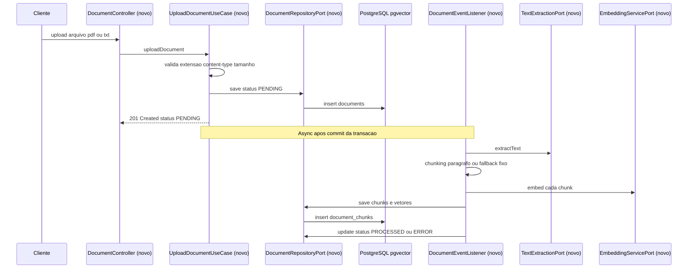
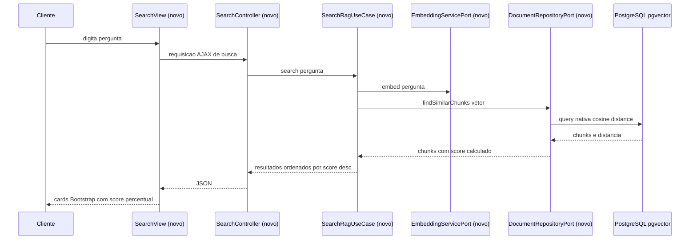

# SPEC: helpdesk-rag

## Metadata
- Source: developer description via /plan (confirmed input, no issue tracker) + `prompts.md` (combined "Prompt Base" + "Prompt de Evolução")
- Service: helpdesk-rag (single Spring Boot repo, package `com.helpdesk.rag`)
- Tier: complete
- Version: 1.1
- Architecture references: **missing** — no `AGENTS.md` / `docs/agents/architecture.md` / `docs/agents/domain_rules.md` / `.github/copilot-instructions.md` found in the repository (confirmed empty except `prompts.md` and `.spec/`). Greenfield repo, no implemented code. Developer explicitly confirmed (clarifier resolve pass, Q-01) that `prompts.md` §2 ("Estrutura de Pacotes (Arquitetura Hexagonal)") remains the **sole** convention source for this feature; no `AGENTS.md` will be created.

## Context
O Help Desk Inteligente com RAG é um case de referência a ser construído do zero: upload de documentos (PDF/TXT), processamento assíncrono pós-commit (extração de texto, chunking, geração de embeddings, persistência vetorial), CRUD completo de documentos com soft delete e lock otimista, e busca semântica por similaridade de cosseno via PostgreSQL/pgvector, exposta em UI Thymeleaf + Bootstrap 5 + jQuery. O repositório está vazio (apenas `prompts.md` e `.spec/`) — não há código, migrations ou testes existentes a preservar; toda a árvore de pacotes, schema e testes será criada por esta feature.

A fonte de verdade combinada é: (1) os 12 ACs confirmados (`.spec/features/helpdesk-rag/.handoff/confirmed-input.md`), e (2) a narrativa completa de stack/regras de negócio/artefatos em `prompts.md` (ambas as seções, tratadas como escopo único). Não existe cadeia `.spec/init/*` — não referenciada.

AC-3 (clarifier resolve pass, Q-02): o desenvolvedor não apenas confirmou o AC-3, mas o **alterou** — a listagem de documentos deixa de ser paginação clássica (`Pageable`/números de página) e passa a ser **scroll infinito** (carregamento automático em lotes de 20 ao aproximar do fim da lista, sem botão "carregar mais"), mantendo ordenação por data de upload decrescente e exclusão de documentos `DELETED`. Ver RF-05, CT-02, UI-02, RNF-07.

## AS IS — Estado atual

_AS IS não aplicável — feature greenfield (repositório sem código implementado; apenas `prompts.md` e `.spec/` existem)._

## TO BE — Estado proposto

Fluxo de upload e processamento assíncrono pós-commit, o núcleo arquitetural da feature: todos os nós são novos (`DocumentController`, `UploadDocumentUseCase`, `DocumentRepositoryPort`, `DocumentEventListener`, `TextExtractionPort`, `EmbeddingServicePort`) e realizam RF-01, RF-02, RF-03, RF-04, RF-11 e RNF-02. O mesmo padrão (listener `@Async` + `AFTER_COMMIT`) é reutilizado por update (RF-06) apagando chunks antigos antes de reprocessar.

Fluxo de busca semântica: todos os nós são novos e realizam RF-10, RNF-07 (fórmula/score) e UI-03 (renderização em cards Bootstrap via AJAX, ordenados por score decrescente).

## Scope
- **In**: upload de documento (PDF/TXT) com validação de extensão/content-type/tamanho; persistência transacional com `status=PENDING`; processamento assíncrono pós-commit (extração Tika, chunking, embeddings 1536-dim, persistência de vetores); máquina de estados `PENDING → PROCESSING → PROCESSED | ERROR` (incluindo transição para `ERROR` quando a extração produz zero chunks); listagem por scroll infinito (lotes de 20, carregamento automático ao aproximar do fim da lista, ordenada por data desc); update com substituição de arquivo e reprocessamento (apagando chunks antigos antes); soft delete com remoção física de chunks/vetores; lock otimista (`@Version`) com HTTP 409 em conflito de concorrência ou update/delete durante `PROCESSING`; busca semântica via query nativa `<=>` (cosseno) com cálculo de score `[0,100]`; UI Thymeleaf/Bootstrap 5/jQuery para upload, listagem e busca (AJAX); `EmbeddingServicePort` com `OpenAiEmbeddingAdapter` (prod) e `FakeEmbeddingAdapter` determinístico (testes, sem rede/API key); migration Flyway `V1__init_schema.sql`; Arquitetura Hexagonal (`domain`/`application`/`infrastructure`, ports in/out) sob `com.helpdesk.rag`; suíte de testes unitários (JUnit5+Mockito) e de integração (Testcontainers `pgvector/pgvector:pg16`).
- **Out**: autenticação/autorização (Spring Security explicitamente fora de escopo); multi-tenancy; histórico/versionamento de múltiplos arquivos por documento (apenas o arquivo atual é mantido); hard delete; formatos além de PDF/TXT; provedores de embedding além de OpenAI/Fake; topologia de deploy/escalabilidade horizontal; internacionalização da UI.

## RIGID (Non-Negotiable)

### Functional Requirements

- RF-01 [Event-Driven]: WHEN um cliente envia upload de um documento (PDF ou TXT) THE SYSTEM SHALL persistir os metadados do documento com `status=PENDING` dentro de uma única transação e publicar um evento de upload (`DocumentUploadedEvent`, per confirmed AC-1 / prompts.md §4) para tratamento pós-commit.
  - AC: Dado um upload válido, quando a transação é commitada, então existe uma linha de documento com `status=PENDING` e o listener do evento é invocado somente após o commit (nunca antes).

- RF-02 [Event-Driven]: WHEN o listener pós-commit recebe o evento de upload THE SYSTEM SHALL extrair o texto via Tika, dividir em chunks (por parágrafo; fallback para blocos fixos de 1000 caracteres com overlap de 200 caracteres quando a divisão por parágrafo não for possível), gerar um embedding de 1536 dimensões por chunk via `EmbeddingServicePort`, e persistir todos os chunks com seus vetores. Se a extração/chunking resultar em **zero chunks** (documento vazio ou apenas com espaços em branco), THE SYSTEM SHALL tratar isso como falha terminal (ver RF-04) em vez de `PROCESSED` com conjunto de chunks vazio.
  - AC: Dado um documento `PENDING`, quando o processamento assíncrono termina sem erro e produz ≥1 chunk, então existem linhas de `document_chunks` para cada chunk produzido, cada uma com vetor de embedding não nulo com exatamente 1536 dimensões, e `Document.status=PROCESSED`.
  - AC (zero chunks): Dado um documento `PENDING` cujo conteúdo extraído é vazio ou apenas espaços em branco (ou cujo chunking não produz nenhum chunk), quando o processamento assíncrono termina, então `Document.status=ERROR`, a mensagem de erro é "Nenhum conteúdo extraído do documento", e zero linhas de `document_chunks` existem para aquele `document_id`.

- RF-03 [State-Driven]: WHILE um documento está sendo processado pelo listener pós-commit THE SYSTEM SHALL manter `Document.status=PROCESSING` desde o início da extração até que um status terminal (`PROCESSED` ou `ERROR`) seja definido.
  - AC: Dado que o listener iniciou o processamento, quando o status é consultado antes do resultado terminal, então `status=PROCESSING`.

- RF-04 [Unwanted]: IF a extração de texto, o chunking ou a geração de embeddings falhar para um documento — incluindo o caso de extração/chunking produzir zero chunks (ver RF-02) — THEN THE SYSTEM SHALL definir `Document.status=ERROR`, persistir a mensagem de falha (para o caso de zero chunks, a mensagem fixa "Nenhum conteúdo extraído do documento"), e excluir o documento da busca semântica (por conteúdo), mantendo-o visível apenas na listagem (busca por metadados).
  - AC: Dada uma falha de extração/embedding, quando o listener assíncrono termina, então `status=ERROR`, a mensagem de erro é não nula, o documento está ausente dos resultados de busca semântica e presente na listagem de documentos.

- RF-05 [Event-Driven]: WHEN um cliente solicita a listagem de documentos THE SYSTEM SHALL retornar resultados em **lotes de scroll infinito** (tamanho de lote padrão 20) ordenados por data de upload decrescente, excluindo documentos com `status=DELETED`, exibindo o status de cada documento; cada requisição de lote subsequente SHALL ser disparada automaticamente pela UI ao aproximar-se do fim da lista atualmente carregada (sem botão "carregar mais" — ver UI-02). O mecanismo de paginação subjacente (offset/limit ou keyset) é detalhe de implementação — ver FLEXIBLE; o comportamento RIGID é o tamanho de lote, a ordenação, a exclusão de `DELETED`, e o carregamento automático via scroll.
  - AC: Dados ≥21 documentos não deletados, quando o primeiro lote é solicitado, então exatamente 20 itens são retornados ordenados por data de upload decrescente, nenhum documento `DELETED` aparece, e uma requisição de lote subsequente (dado o scroll do cliente) retorna os próximos itens sem repetir os já carregados.

- RF-06 [Event-Driven]: WHEN um cliente submete um update com novo arquivo para um documento existente THE SYSTEM SHALL substituir a referência do arquivo armazenado e publicar um evento de atualização (`DocumentUpdatedEvent`, per confirmed AC-4 + prompts.md "Prompt de Evolução" §1); o listener pós-commit SHALL primeiro apagar fisicamente os chunks/vetores existentes do documento e só então reprocessar o novo arquivo, transicionando `status` por `PROCESSING → PROCESSED | ERROR`.
  - AC: Dado um documento fora de `PROCESSING`, quando o update é submetido com um novo arquivo válido, então as linhas antigas de `document_chunks` daquele `document_id` deixam de existir, novos chunks são criados a partir do novo arquivo, e o status termina como `PROCESSED` ou `ERROR`.

- RF-07 [Unwanted]: IF uma requisição de update ou delete tem como alvo um documento com `status=PROCESSING` THEN THE SYSTEM SHALL rejeitar a requisição com HTTP 409 e uma mensagem identificando o estado conflitante.
  - AC: Dado `Document.status=PROCESSING`, quando update ou delete é solicitado, então a resposta é HTTP 409 e nenhuma mutação é persistida.

- RF-08 [Event-Driven]: WHEN um cliente solicita a exclusão de um documento THE SYSTEM SHALL realizar soft delete — definir `status=DELETED` e `deleted_at` com o timestamp atual — e apagar fisicamente os chunks e vetores associados ao documento.
  - AC: Dado um documento fora de `PROCESSING`, quando o delete é solicitado, então a linha do documento permanece com `status=DELETED` e `deleted_at` não nulo, e zero linhas de `document_chunks` permanecem para aquele `document_id`.

- RF-09 [State-Driven]: WHILE um documento tem `status=DELETED` THE SYSTEM SHALL excluí-lo **sempre** tanto da listagem quanto dos resultados de busca semântica — não existe parâmetro/endpoint de override nem visão administrativa de documentos deletados (fora de escopo).
  - AC: Dado um documento `DELETED`, quando a listagem ou a busca é executada, então o documento nunca aparece nos resultados.

- RF-10 [Event-Driven]: WHEN um cliente submete uma pergunta de busca semântica THE SYSTEM SHALL converter a pergunta em vetor de embedding, executar uma query nativa de distância de cosseno (`<=>`) via pgvector sobre `document_chunks`, calcular `score = ROUND((1 - distância) * 100, 2)` limitado ao intervalo `[0, 100]` para cada resultado, e retornar os resultados ordenados por score decrescente.
  - AC: Dado ≥1 documento `PROCESSED` não deletado com chunks, quando uma pergunta de busca é submetida, então todo resultado retornado tem score em `[0, 100]` com exatamente 2 casas decimais, e os resultados estão ordenados por score decrescente.

- RF-11 [Conditional]: WHERE a extensão do arquivo enviado não é `.pdf`/`.txt`, ou o tamanho excede 10 MB, THE SYSTEM SHALL rejeitar o upload com erro de validação antes de qualquer persistência. A extensão é o sinal primário de validação; o content-type é um sinal secundário de sanidade: content-type genérico ou ausente (ex.: `application/octet-stream`, vazio) SHALL ser aceito quando a extensão é válida; o upload SHALL ser rejeitado por content-type apenas quando este estiver presente e contradizer explicitamente um tipo conhecido diferente do esperado para a extensão (ex.: arquivo `.txt` declarado como `image/png`).
  - AC: Dado um arquivo com extensão não permitida, ou tamanho >10MB (10.485.760 bytes), quando o upload é submetido, então nenhuma linha de `Document` é criada e uma resposta de erro de validação é retornada.
  - AC (content-type fallback): Dado um arquivo com extensão válida (`.pdf`/`.txt`) e content-type ausente ou `application/octet-stream`, quando o upload é submetido, então o upload é aceito (não rejeitado por content-type).
  - AC (content-type contraditório): Dado um arquivo com extensão válida mas content-type presente e explicitamente contraditório (ex.: `.txt` com `image/png`), quando o upload é submetido, então nenhuma linha de `Document` é criada e uma resposta de erro de validação é retornada.

- RF-12 [Unwanted]: IF duas requisições concorrentes de update/delete têm como alvo o mesmo `Document` e a versão de lock otimista lida pela segunda requisição não corresponde mais à versão persistida THEN THE SYSTEM SHALL rejeitar a segunda requisição com HTTP 409.
  - AC: Dado um `Document` com `@Version=N`, quando uma requisição é processada contra uma versão desatualizada, então a resposta é HTTP 409 e o estado persistido do documento não é alterado pela requisição desatualizada.

### UI Requirements

- UI-01 [Event-Driven]: WHEN um usuário submete o formulário de upload THE SYSTEM SHALL exibir feedback do resultado (sucesso com status `PENDING`, ou erro de validação) sem recarregamento completo da página, usando jQuery AJAX.
  - AC: Dado um arquivo válido selecionado, quando o usuário submete o formulário, então a página exibe um indicador de sucesso e o status do novo documento sem navegar para outra URL.

- UI-02 [Event-Driven]: WHEN um usuário abre a página de listagem de documentos THE SYSTEM SHALL renderizar uma tabela/lista com **scroll infinito** (lotes de 20, carregamento automático via jQuery AJAX ao aproximar-se do fim da lista carregada, sem botão "carregar mais") com um badge colorido de status por documento (`PENDING`/`PROCESSING`/`PROCESSED`/`ERROR`) e controles de ação de editar/excluir, usando Thymeleaf + Bootstrap 5.
  - AC: Dados documentos em status variados, quando a página renderiza, então cada linha exibe um badge cuja cor/texto corresponde ao status do documento e expõe controles de editar e excluir.
  - AC (scroll infinito): Dados ≥21 documentos não deletados, quando a página inicial carrega, então exatamente 20 itens são exibidos; quando o usuário rola até próximo do fim da lista, então uma requisição AJAX automática carrega o próximo lote e o anexa à lista, sem recarregar a página.

- UI-03 [Event-Driven]: WHEN um usuário submete uma pergunta na seção de busca semântica THE SYSTEM SHALL disparar uma requisição AJAX e renderizar os resultados como cards Bootstrap exibindo documento de origem, trecho do chunk e percentual de score, ordenados por score decrescente, sem recarregamento completo da página.
  - AC: Dados ≥2 resultados com scores diferentes, quando os resultados renderizam, então os cards aparecem em ordem decrescente de score e cada card exibe nome do documento, trecho do chunk e um percentual correspondente ao score retornado.

### Contracts

- CT-01: Upload de documento — endpoint HTTP que aceita `multipart/form-data` com um único arquivo; valida extensão/content-type/tamanho antes de persistir (RF-11); retorna HTTP 201 com o id do documento criado e `status=PENDING` em caso de sucesso; retorna HTTP 400 para arquivo inválido. Caminho de rota exato não definido pela fonte confirmada — ver FLEXIBLE.
- CT-02: Listagem de documentos — endpoint HTTP GET retornando um lote de resultados para scroll infinito (tamanho de lote padrão 20, ordenado por data desc), excluindo `status=DELETED`, cada item expondo id/nome/status; suporta requisição do lote seguinte a partir do último item carregado (offset/limit ou cursor/keyset — detalhe de implementação, ver FLEXIBLE) (RF-05).
- CT-03: Update de documento — endpoint HTTP que aceita novo arquivo para um `document_id` existente; retorna HTTP 200 com `status=PROCESSING` em caso de aceite; retorna HTTP 409 se o documento atual está `PROCESSING` (RF-06, RF-07).
- CT-04: Delete de documento — endpoint HTTP que executa soft delete; retorna HTTP 200/204 em caso de sucesso; retorna HTTP 409 se o documento atual está `PROCESSING` (RF-08, RF-07).
- CT-05: Busca semântica — endpoint HTTP consumido via AJAX/JSON, aceitando uma pergunta em texto livre; retorna array JSON de resultados com referência ao documento, texto do chunk, e score `[0,100]` com 2 casas decimais, ordenados por score decrescente, excluindo documentos `DELETED` (RF-10, UI-03).
- CT-06: `EmbeddingServicePort` (per confirmed AC-12 / prompts.md §1) — contrato interno: entrada texto (regras exatas de normalização não fixadas aqui — ver FLEXIBLE), saída vetor de exatamente 1536 dimensões float. Duas implementações obrigatórias: `OpenAiEmbeddingAdapter` (produção, via Spring AI/OpenAI `text-embedding-3-small`) e `FakeEmbeddingAdapter` (determinístico, sem dependência de rede/API key, usado exclusivamente em testes; determinístico significa que o mesmo texto de entrada sempre produz o mesmo vetor de saída, para estabilidade dos testes de integração que dependem de scores repetíveis).

### Non-Functional Requirements

- RNF-01: THE SYSTEM SHALL organizar o código sob o pacote `com.helpdesk.rag` seguindo Arquitetura Hexagonal estrita: `domain` (entidades puras/VOs/enums), `application.ports.in` (interfaces de use case), `application.ports.out` (interfaces de persistência/IA/extração de texto), `application.usecase` (implementações de use case), `infrastructure.adapters.in.web` (controllers/views), `infrastructure.adapters.out.persistence` (JPA + Flyway), `infrastructure.adapters.out.ai` (adapters de embedding e Tika), `infrastructure.config` (beans, `TaskExecutor`, configuração de eventos transacionais) — per confirmed AC-9 e `prompts.md` §2 (única fonte de convenção disponível, na ausência de AGENTS.md/docs/agents).
  - AC: Revisão estrutural do repositório confirma que nenhuma classe de domínio depende de classes de `infrastructure`, e que todo acesso a persistência/IA/extração de texto ocorre via as portas de `application.ports.out`.

- RNF-02: THE SYSTEM SHALL executar o listener de processamento pós-commit via um executor `@Async` dedicado combinado com `@TransactionalEventListener(phase = AFTER_COMMIT)`, de forma que a thread HTTP de upload/update retorne antes do início da extração de texto, chunking ou geração de embeddings.
  - AC: Em teste com `EmbeddingServicePort` mockado com atraso artificial, a resposta HTTP do upload/update retorna antes da invocação do mock ser concluída.

- RNF-03: THE SYSTEM SHALL fornecer uma migration Flyway `V1__init_schema.sql` (per confirmed AC-11) que cria a extensão `vector`, a tabela `documents`, a tabela `document_chunks` com coluna `embedding VECTOR(1536)`, e um índice HNSW com `vector_cosine_ops` sobre essa coluna.
  - AC: Em banco limpo, após `flyway migrate`, `pg_extension` contém `vector`, ambas as tabelas existem com as colunas especificadas, e existe um índice de método de acesso `hnsw` com classe de operador `vector_cosine_ops` sobre `document_chunks.embedding`.

- RNF-04: THE SYSTEM SHALL garantir que a suíte de testes automatizados não requeira acesso à rede nem uma `OPENAI_API_KEY` para executar (via `FakeEmbeddingAdapter`, per confirmed AC-12).
  - AC: A suíte de testes completa executa e passa em um ambiente sem acesso à rede externa e sem a variável de ambiente `OPENAI_API_KEY` definida.

- RNF-05: THE SYSTEM SHALL fornecer testes unitários (JUnit5+Mockito) para cada use case (Upload, Update, Delete, List, Search), cobrindo as transições da máquina de estados (`PENDING→PROCESSING→PROCESSED|ERROR`, incluindo a transição para `ERROR` por zero chunks extraídos — RF-02) e o caminho de rejeição por conflito de estado (409 por `PROCESSING`, RF-07). A rejeição por lock otimista desatualizado (409 por versão, RF-12) é coberta em nível de integração real — ver RNF-06 — não apenas por mock unitário, já que depende do comportamento do provedor JPA/`OptimisticLockException` em uma transação real.
  - AC: Cada use case possui ≥1 teste por transição de estado (incluindo zero-chunk → `ERROR`) e ≥1 teste para o caminho de rejeição 409 `PROCESSING`.

- RNF-06: THE SYSTEM SHALL fornecer testes de integração baseados em Testcontainers usando a imagem `pgvector/pgvector:pg16` cobrindo: persistência de chunks/vetores, fluxo completo pós-commit usando `FakeEmbeddingAdapter`, a query nativa de busca por similaridade com cálculo de score, a rejeição de update/delete concorrente durante `PROCESSING` (RF-07), e a rejeição de update/delete concorrente por lock otimista desatualizado — `@Version` obsoleto → `OptimisticLockException` real surfaced como HTTP 409 (RF-12) — como cenário distinto do conflito por `PROCESSING`.
  - AC: Os cinco cenários cobertos possuem ≥1 teste passando cada, e zero testes dependem de chamada de rede externa.

- RNF-07: THE SYSTEM SHALL aplicar os seguintes limiares quantificados: tamanho máximo de upload 10 MB (10.485.760 bytes); dimensionalidade de embedding exatamente 1536; chunk fallback de 1000 caracteres com overlap de 200 caracteres; tamanho de lote (batch) padrão 20 para scroll infinito da listagem; score no intervalo `[0, 100]` arredondado a 2 casas decimais.
  - AC: Testes automatizados verificam cada valor de limiar exatamente (não aproximadamente).

- RNF-08: THE SYSTEM SHALL NOT implementar autenticação/autorização (Spring Security fora de escopo, per confirmed AC/prompts.md §1); esta exclusão SHALL estar documentada explicitamente em comentário no README ou na configuração, para não ser confundida com omissão.
  - AC: O README ou um arquivo de configuração contém uma declaração explícita de que segurança está intencionalmente fora de escopo.

## FLEXIBLE (Implementation Suggestions)
- Caminhos de rota REST sugeridos (não fixados por CT-01..CT-05): `POST /api/documents`, `GET /api/documents`, `PUT /api/documents/{id}`, `DELETE /api/documents/{id}`, `GET /api/search?q=...` (ou `POST /api/search` com corpo JSON).
- Mecanismo de paginação subjacente ao scroll infinito (RF-05/CT-02): offset/limit (`Pageable`) ou keyset/cursor (ex.: `?after={id|timestamp}&size=20`) — escolha de implementação, documentar no PLAN. O comportamento RIGID é apenas a UX (auto-load em lotes de 20 ao aproximar do fim da lista).
- Regras exatas de normalização de texto para `EmbeddingServicePort`/`FakeEmbeddingAdapter` (CT-06): trim, case-folding, colapso de espaços em branco, etc. — implementação livre, com a única restrição RIGID de que o resultado seja determinístico (mesmo texto de entrada → mesmo vetor de saída).
- Nome de bean do executor assíncrono: `documentProcessingExecutor` (exemplo citado em `prompts.md`).
- Separação entre entidades JPA (`DocumentJpaEntity`, `DocumentChunkJpaEntity`) e entidades de domínio puras (`Document`, `DocumentChunk`), com mapeamento manual ou MapStruct.
- Algoritmo de chunking por parágrafo: split por linhas em branco duplas / regex de parágrafo, com fallback determinístico para blocos fixos.
- Parâmetros de tuning do índice HNSW (`m`, `ef_construction`) não especificados pelos ACs — escolha de implementação, documentar valores escolhidos no PLAN.
- Estrutura de DTOs de request/response por controller, mensagens de erro de validação (Bean Validation `@NotNull`/`@Size` etc.).
- Uso de Spring AI `EmbeddingModel` abstraction para `OpenAiEmbeddingAdapter` vs. chamada HTTP direta à API OpenAI.
- Estrutura do `docker-compose.yml` para ambiente local (`pgvector/pgvector:pg16`), fora do escopo de testes automatizados.
- Nome/estrutura das views Thymeleaf (`upload.html`, `documents.html`, `search.html` ou fragmentos).

## Acceptance Criteria Summary

| ID | Criterion | Testable? |
|----|-----------|-----------|
| RF-01 | Upload salva metadados `PENDING` em transação e publica evento pós-commit | Sim |
| RF-02 | Listener pós-commit extrai/chunk/embed/persiste; status → `PROCESSED` | Sim |
| RF-03 | Status permanece `PROCESSING` durante o processamento | Sim |
| RF-04 | Falha em qualquer etapa → `status=ERROR`, mensagem persistida, exclusão da busca semântica | Sim |
| RF-05 | Listagem por scroll infinito (lotes de 20, auto-load), ordenada por data desc, exclui `DELETED` | Sim |
| RF-06 | Update apaga chunks antigos antes de reprocessar; status → `PROCESSED\|ERROR` | Sim |
| RF-07 | Update/Delete durante `PROCESSING` → HTTP 409 | Sim |
| RF-08 | Delete lógico: `DELETED`+`deleted_at`, chunks/vetores apagados fisicamente | Sim |
| RF-09 | Documentos `DELETED` sempre excluídos de listagem e busca (sem override) | Sim |
| RF-10 | Busca semântica: vetor da pergunta, query `<=>`, score `[0,100]` 2 casas, ordenado desc | Sim |
| RF-11 | Upload valida extensão/tamanho ≤10MB antes de persistir; content-type é sanidade secundária com fallback para octet-stream/ausente | Sim |
| RF-12 | Lock otimista: versão desatualizada → HTTP 409 | Sim |
| UI-01 | Feedback de upload via AJAX sem reload | Sim |
| UI-02 | Listagem com scroll infinito (lotes de 20, auto-load), badge de status e ações editar/excluir | Sim |
| UI-03 | Busca semântica via AJAX, cards Bootstrap ordenados por score desc | Sim |
| CT-01 | Endpoint de upload: 201/PENDING ou 400 | Sim |
| CT-02 | Endpoint de listagem por lotes (scroll infinito) | Sim |
| CT-03 | Endpoint de update: 200/PROCESSING ou 409 | Sim |
| CT-04 | Endpoint de delete: 200/204 ou 409 | Sim |
| CT-05 | Endpoint de busca: JSON com score ordenado desc | Sim |
| CT-06 | `EmbeddingServicePort` com 2 implementações (prod/fake, sem rede em testes) | Sim |
| RNF-01 | Pacotes Hexagonais sob `com.helpdesk.rag` | Sim (revisão estrutural) |
| RNF-02 | Listener `@Async`+`AFTER_COMMIT` não bloqueia thread HTTP | Sim |
| RNF-03 | Migration `V1__init_schema.sql`: extensão vector, tabelas, índice HNSW | Sim |
| RNF-04 | Testes sem rede/API key | Sim |
| RNF-05 | Testes unitários por use case (estados + concorrência) | Sim |
| RNF-06 | Testes de integração Testcontainers (`pgvector/pgvector:pg16`), incl. 409 por `@Version` desatualizado | Sim |
| RNF-07 | Limiares quantificados (10MB, 1536, 1000/200, 20, score 2 casas) | Sim |
| RNF-08 | Segurança fora de escopo, documentado explicitamente | Sim |
